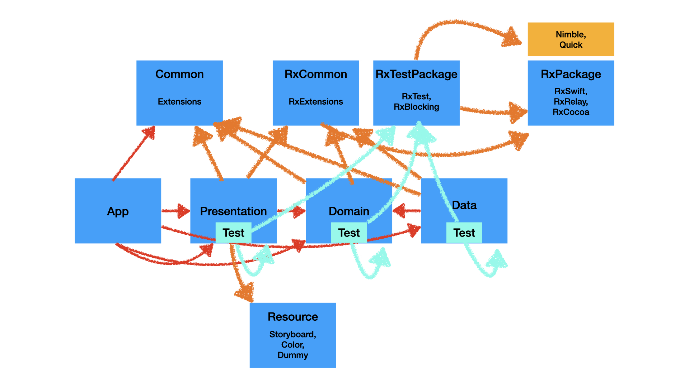

# 프로젝트 소개
> Sound Anywhere은 일상 속 의미있는 공간에 어울리는 음원을 공유하는 서비스입니다.

## 프로젝트 구조
### **MVVM** 기반 **Clean Architecture**
* * *

* * *

## 프로젝트 구현 기능
### 지도 화면

| 위치 권한 요청 및 현재 위치 표시    | 사운드 존 표시                  | 
| --------------------------- | --------------------------- | 
|   |   | 

## 기술적 도전

---

### Clean Architecture
- 비즈니스 로직을 외부 레이어(Presentation, Data)에 독립적으로 테스트 할 수 있습니다. (외부 레이어에 의존하지 않습니다)

---

### Modularization
- Clean Architecture 각 Layer를 별도 모듈로 분리하여 Layer간 의존성을 명확하게 관리하였습니다.
- Storyboard, Asset, Dummy Data(json)를 Resource 모듈로 분리하였습니다.
- 전역적으로 사용되는 Extension, UserDefault를 Common 모듈로 분리하였습니다.
- 빌드 속도를 개선하였습니다.

---

### MVVM
- Data Binding을 통해 ViewModel이 View에 의존하지 않으므로 View에 독립적으로 테스트 할 수 있습니다.

---

### RxSwift
- Observable 모델은 비동기 이벤트 스트림을 Operator로 쉽게 처리할 수 있습니다. 복잡한 CallBack을 회피하여 가독성을 개선하고 의도치 않은 버그를 피할 수 있습니다.

---

### Testablity
- Concrete Type 대신 Interface에 의존하여 Testability를 개선하였습니다.
- 인터페이스를 Command, Query 인터페이스로 분리하여 Mock, Stub의 활용성을 높였습니다.
- Firestore 대신 HashTable로 구현한 FakeFirestore(모든 Operation의 Time Complexity는 O(1) 보장)를 Debug/Unit Test에 이용하여 Firestore에 대한 Side Effect와 Unit Test 시간을 줄였습니다.

---
