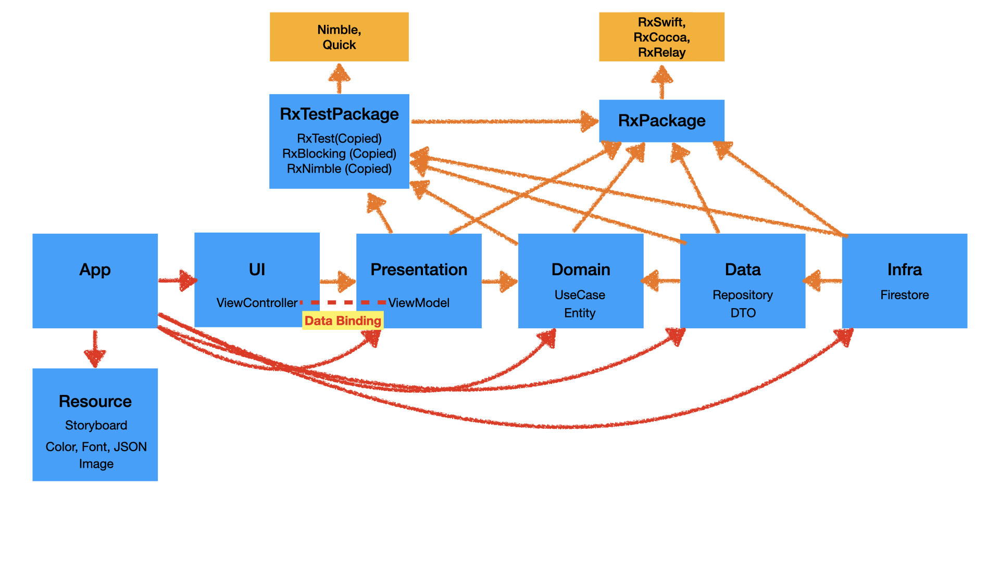

# 프로젝트 소개
### 일상 속 의미있는 공간에 어울리는 음원을 공유하는 위치기반 서비스

## 프로젝트 구조
### **MVVM** / **Clean Architecture**
* * *

* * *

## 프로젝트 구현 기능
### 지도 화면

| 위치 권한 요청 및 현재 위치 표시    | 사운드 존 표시 |
| --------------------------- | --------------------------- |
|   |  |

## 기술적 도전

---

### Clean Architecture
- Dependency Rule: UI(View/ViewController) -> Presentation(ViewModel) -> Domain(Usecase,Entities) <-
  Data(Repository) <- Infra(Network,DB)
- 장점: 비즈니스 로직은 외부 레이어의 변경에 영향을 받지 않음(외부 레이어에 의존X). 외부 레이어에 독립적 테스트 가능.

---

### Modularization
- Clean Architecture 각 Layer를 별도 모듈로 분리.
- Storyboard, Asset(color, image, json, etc)를 Resource 모듈로 분리.
- 전역적으로 사용되는 Extension, UserDefault를 Common 모듈로 분리.
- Rx에 의존적인 Extension을 RxCommon 모듈로 분리.
- RxPackage, RxTestPackage 모듈로 Unit Test시 RxSwift [중복적재 이슈](./Trouble-Shooting/001.md) 해결. 

---

### MVVM
- Reponsibility: Abstraction Of View (ViewState, Command/Action(Execute Model Behavior), 
  Value Converter(Convert ModelOutput to ViewState)).
- 필요 조건: Data Binding (When the state of the view model is changed, the state of the view is
  changed together, and vice versa. Reponsibility of View)
- 장점: ViewModel has no dependency to a View -> ViewModel can be Testable, Reusable.

---

### RxSwift
- Observable 모델은 비동기 이벤트 스트림을 Operator로 쉽게 처리. 또한 복잡한 CallBack을 회피하여 가독성 개선,
의도하지 않은 버그 회피.
- MVVM(View와 ViewModel간 Data Binding)에 적합.

---

### Testablity
- Concrete Type 대신 Interface에 의존하여 Testability 개선.
- 각 인터페이스를 Command, Query 인터페이스로 분리하여 Unit Test에 Mock, Stub 적용.
- Firestore 대신 HashTable로 구현한 FakeFirestore를 Debug/Unit Test에 도입하여 Side Effect 제거, 
Unit Test 시간 감축.

---

## 기술 스터디
###
[1. HLS(예정)](./Study/001.md)
 
[2. RTSP/RTP(예정)](./Study/002.md)
 
[3. RTMP(예정)](./Study/003.md)
 
[4. SRT(예정)](./Study/004.md)
 
[5. WebRTC(예정)](./Study/005.md)
 
###

## 기술적 고민
###
[1. CoreLocation 위치권한처리](./Technical-Difficulties/001.md)
 
[2. Unit Test](./Technical-Difficulties/002.md)
 
[3. UI Test](./Technical-Difficulties/003.md)
 
[4. Networking(예정)](./Technical-Difficulties/004.md)
 
###

---

## 트러블 슈팅

### 
[1. UnitTest Target에 RxTest/RxBlocking 추가 시 RxSwift 중복적재 문제](./Trouble-Shooting/001.md)
 
### 
