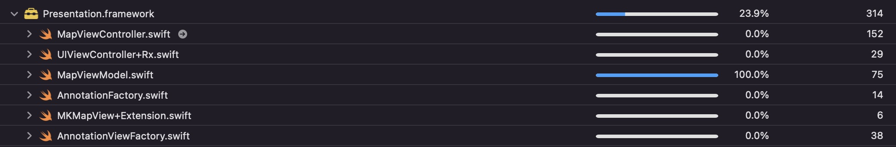
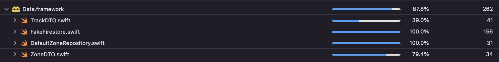
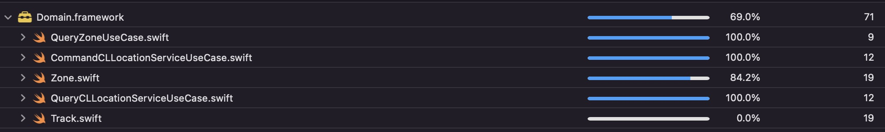

## Problem : Unit Test

---

### 1. Dependency Inversion: Concrete Type 대신 Interface(Protocol)에 의존
MapViewModel은 다음과 같이 UseCase Interface에 의존.

```swift
public final class MapViewModel: MapViewModelInputs, MapViewModelOutputs, MapViewModelType {
...
// MARK: - Dependencies

private let queryCLLocationServiceUseCase: QueryCLLocationServiceUseCase
private let commandCLLocationServiceUseCase: CommandCLLocationServiceUseCase
private let queryZoneUseCase: QueryZoneUseCase

...
}
```

Inteface에 의존하면 다음과 같이 UseCase 인스턴스를 Mock/Stub을 교체/주입하여 Unit Test 용이.
```swift
MapViewModel(defaultLocation: CLLocation(latitude: 37.54887101,
                                         longitude: 126.91332598),
             queryCLLocationServiceUseCase: queryCLLocationServiceUseCaseStub,
             commandCLLocationServiceUseCase: commandCLLocationServiceUseCaseMock,
             queryZoneUseCase: queryZoneUseCaseStub)
```
--- 

### 2. Dependency Injection
DIP에 의해 각 타입은 하위타입의 Interface에 의존. 따라서, 상위타입에서 하위구체타입 인스턴스를 생성하여 각 타입에 주입.
SceneDelegate를 Composition Root로 설정. SwinjectStoryboard 도입하여 ViewController에 ViewModel 주입.

```swift
private func configureWindow(_ windowScene: UIWindowScene) {
    let storyboardID = Resource.Storyboard.ID.map
    let storyboard = SwinjectStoryboard.create(name: storyboardID.stringValue,
                                               bundle: Resource.bundle,
                                               container: container)
    window = UIWindow(windowScene: windowScene)
    window?.rootViewController = storyboard.instantiateViewController(withIdentifier: storyboardID.stringValue)
    window?.makeKeyAndVisible()
}
```

- Reference: https://blog.ploeh.dk/2011/07/28/CompositionRoot/

--- 

### 3. Command-Query Separation
"Asking a question should not change the answer." 의도치 않은 버그 회피. Unit Test에 Stub, Mock을 명확히 구분하여
적용할 수 있는 이점.

```swift
// Domain Layer - UseCase

public protocol CommandCLLocationServiceUseCase {
    func requestWhenInUseAuthorization()
    func startUpdatingLocation()
    func stopUpdatingLocation()
}

public protocol QueryCLLocationServiceUseCase {
    func queryInitialAuthorizationStatus() -> CLAuthorizationStatus?
    func observeAuthorizationStatus() -> Observable<CLAuthorizationStatus>
    func observeLocation() -> Observable<CLLocation?>
}
```
- Reference: https://blog.pragmatists.com/test-doubles-fakes-mocks-and-stubs-1a7491dfa3da

---

### 4. Stub, Mock
Command-Query Separation을 통해 Stub, Mock 적용.
```
 Stub is an object that holds predefined data and uses it to answer calls during tests. It is used 
when we cannot or don’t want to involve objects that would answer with real data or have undesirable
side effects.

 Mocks are objects that register calls they receive. In test assertion we can verify on Mocks that all
expected actions were performed.
```

다음과 같이 Command/Query Interface를 conform하는 Stub, Mock을 간단하게 구현하여 Unit Test에 활용.

```swift
final class QueryCLLocationServiceUseCaseStub: QueryCLLocationServiceUseCase {
    var initialAuthorizationStatus_ReturnValue: CLAuthorizationStatus = .notDetermined
    var observeAuthorizationStatus_ReturnValue: Observable<CLAuthorizationStatus> = Observable.just(.notDetermined)
    var observeLocation_ReturnValue: Observable<CLLocation?> = Observable.just(nil)
    
    func queryInitialAuthorizationStatus() -> CLAuthorizationStatus? {
        return initialAuthorizationStatus_ReturnValue
    }
    
    func observeAuthorizationStatus() -> Observable<CLAuthorizationStatus> {
        return observeAuthorizationStatus_ReturnValue
    }
    
    func observeLocation() -> Observable<CLLocation?> {
        return observeLocation_ReturnValue
    }
}

final class CommandCLLocationServiceUseCaseMock: CommandCLLocationServiceUseCase {
    var requestWhenInUseAuthorization_Called = false
    var startUpdatingLocation_Called = false
    var stopUpdatingLocation_Called = false
    
    func requestWhenInUseAuthorization() {
        requestWhenInUseAuthorization_Called = true
    }
    
    func startUpdatingLocation() {
        startUpdatingLocation_Called = true
    }
    
    func stopUpdatingLocation() {
        stopUpdatingLocation_Called = true
    }
}
```
- Reference: https://blog.pragmatists.com/test-doubles-fakes-mocks-and-stubs-1a7491dfa3da

---

### 5. Fake
```
 Fakes are objects that have working implementations, but not same as production one. Usually they 
take some shortcut and have simplified version of production code.
```

 Debug/Test가 실제 Firestore(DB)에 의존하면 Side Effect(Command Request), Time Consuming 문제 발생. HashMap
자료구조로 구현한 FakeFirestore를 구현/적용하면 동일한 Operation에 대해 Time Complexity O(1)을 보장, Side Effect 제거.

```swift
public final class FakeFirestore<T> {
    enum FirestoreError: Error {
        case documentNotExist
        case documentsNotExist
        case documentAleadyExist
        case dummyNotExist
    }
    
    var db: [String: Collection] = [:]
    
    public init() {}
    
    func collection(name: String) -> Collection {
        guard let collection = db[name] else {
            let newCollection = Collection()
            db[name] = newCollection
            return newCollection
        }
        return collection
    }
}

// MARK: - FakeFirestore.Collection

extension FakeFirestore {
    final class Collection {
        var collection: [String: Document] = [:]
        
        func document(name: String) -> Document {
            guard let document = collection[name] else {
                let newDocument = Document()
                collection[name] = newDocument
                return newDocument
            }
            return document
        }
        
        func getDocuments(completion: @escaping (Result<[T],FirestoreError>) -> Void) {
            let data = collection.compactMap { $0.value.data }
            
            if data.isEmpty {
                completion(.failure(.documentsNotExist))
            } else {
                completion(.success(data))
            }
        }
    }
}

// MARK: - FakeFirestore.Collection.Document

extension FakeFirestore.Collection {
    final class Document {
        var data: T?
        
        func setData(from data: T, completion: @escaping (Result<T,FakeFirestore.FirestoreError>) -> Void) {
            guard self.data != nil else {
                self.data = data
                completion(.success(data))
                return
            }
            completion(.failure(.documentAleadyExist))
        }
        
        func getDocument(completion: @escaping (Result<T,FakeFirestore.FirestoreError>) -> Void) {
            guard let data = data else {
                completion(.failure(.documentNotExist))
                return
            }
            completion(.success(data))
        }
    }
}
```

- Reference: https://blog.pragmatists.com/test-doubles-fakes-mocks-and-stubs-1a7491dfa3da

---

### 6. Dummy
원활한 테스트를 위해 FakeFirestore에 Dummy 세팅. Dummy는 다음과 같이 Resource 모듈에서 Asset(json)으로 관리.

```swift
extension Resource {
    public final class Dummy {
        enum ID: String {
            case zone
            
            var stringValue: String {
                return self.rawValue.firstCharCapitalized
            }
        }
        
        let data: Data
        
        init?(id: ID) {
            guard let asset = NSDataAsset.init(name: id.stringValue, bundle: Resource.bundle) else {
                return nil
            }
            self.data = asset.data
        }
    }
}

extension Resource.Dummy {
    typealias Dummy = Resource.Dummy
    
    public static var zone: Data? { Dummy(id: .zone)?.data }
}
```
---

### 7. 실패(Fail) 케이스 테스트
FakeFireStore에 데이터가 없을 때, 알맞는 Error를 반환하는지 테스트.

```swift
func test_getDocument_then_succeed() {
    // When
    setData()
    
    // Then
    expect(self.fakeFirestore.getDocument(collection: "zone", document: "합정")).first == data
}

func test_getDocument_then_fail() {
    // Then
    expect(self.fakeFirestore.getDocument(collection: "zone", document: "합정")).first
        .to(throwError(FakeFirestore<ZoneDTO>.FirestoreError.documentNotExist))
}

func test_getDocuments_then_succeed() {
    // When
    setData()
    
    // Then
    expect(self.fakeFirestore.getDocuments(collection: "zone")).first == [data]
}

func test_getDocuments_then_fail() {
    // Then
    expect(self.fakeFirestore.getDocuments(collection: "zone")).first
        .to(throwError(FakeFirestore<ZoneDTO>.FirestoreError.documentsNotExist))
}
```

---

### 8. Test Coverage

| Presentation | Domain | Data |
| --------------------------- | --------------------------- | --------------------------- |
|   |  |  |
---
