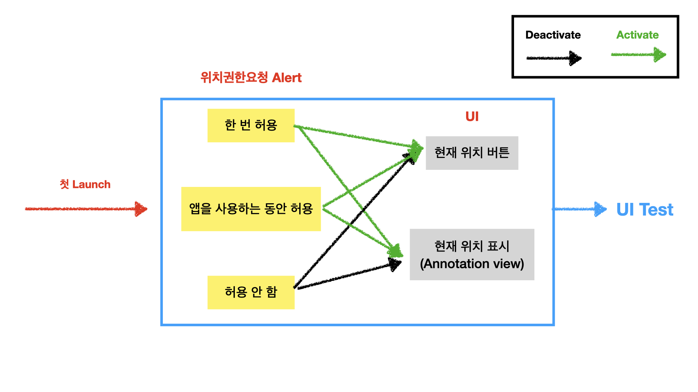
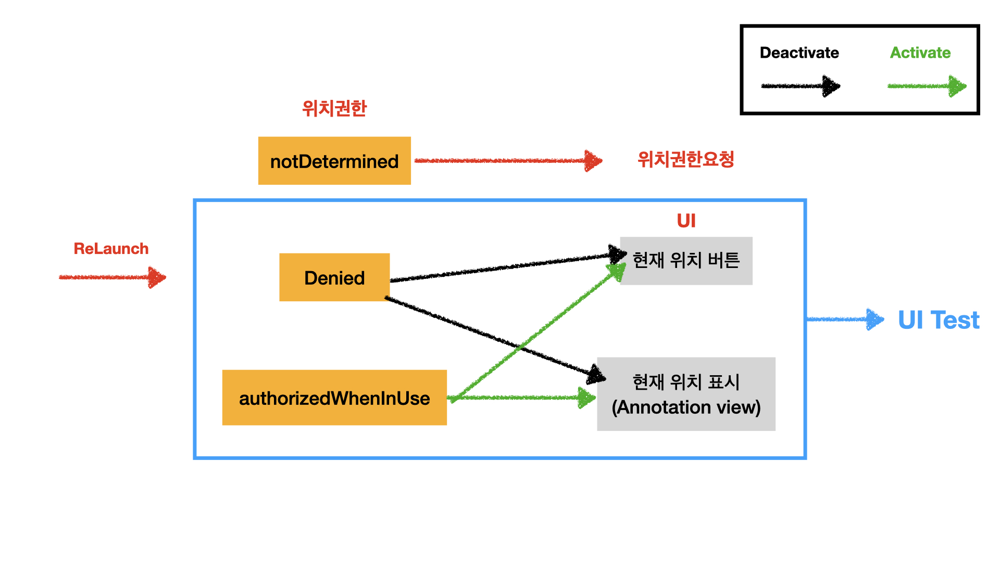

## Problem : UI Test

---

### Scenario 1 : 첫 Launch

첫 Launch 시 위치권한요청 System Alert을 어떻게 Tap할 것인가?

- 해결방법
```
방법 1: sleep -> System Alert가 뜨기 충분한 고정시간 대기 -> alert이 뜬 이후 대기하는 비효율
방법 2: addUIInterruptionMonitor -> alert 뜨는 시점 감지 -> 방법 1의 문제점 해결.
```

- 방법2 적용
```swift
let monitor = addUIInterruptionMonitor(withDescription: "위치권한요청") { alert in
    if alert.labelContains(text: "사용자의 위치를 사용하도록 허용하겠습니까?") {
        alert.buttons["허용 안 함"].tap()
        return true
    }
    return false
}
```


- Reference: https://developer.apple.com/videos/play/wwdc2020/10220/,
             https://developer.apple.com/videos/play/wwdc2015/406/
---

### Scenario 2 : 앱 종료 후 reLaunch

위치권한 denied인 상태로 reLaunch하는 경우는 어떻게 테스트해야 할까?

- 해결방법
```
- 앱의 authorizationStatus를 programmatically하게 set 해줄 수 있는 방법을 찾지 못함.
해결: XCUIApplication 생명주기 활용
1. 위치권한 alert "허용 안 함" tap
2. 앱 종료 (XCUIApplication.terminate())
3. 앱 재시동 (XCUIApplication.launch())
```

- 적용
```swift
app.launch()

// ... 허용 안 함 탭

app.terminate()

app.launch()
expect(self.app.otherElements["현재 위치"].exists).to(equal(false))
```

---
