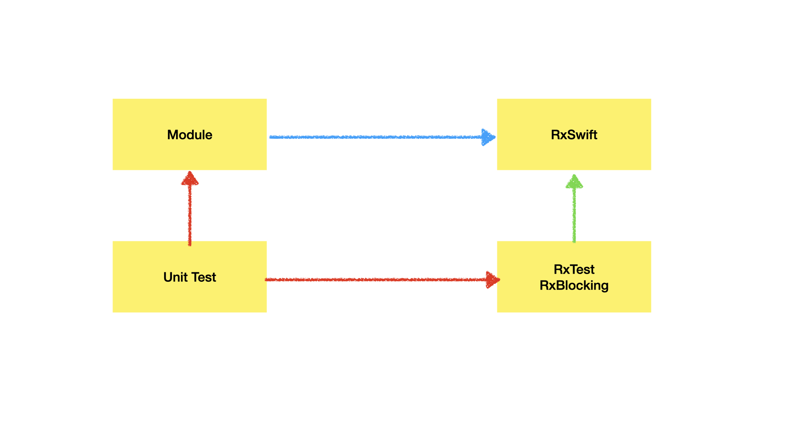
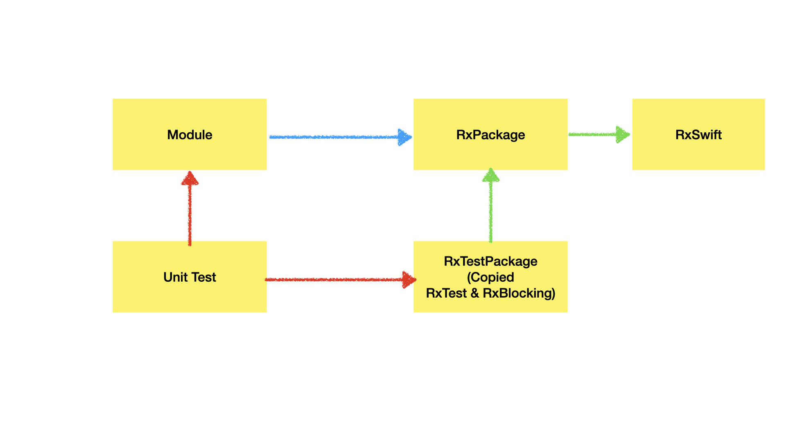

## Problem : UnitTest Target에 RxTest/RxBlocking 추가 -> RxSwift 중복 적재

---

## RxSwift Dependencies

```
┌──────────────┐    ┌──────────────┐
│   RxCocoa    ├────▶   RxRelay    │
└───────┬──────┘    └──────┬───────┘
        │                  │        
┌───────▼──────────────────▼───────┐
│             RxSwift              │
└───────▲──────────────────▲───────┘
        │                  │        
┌───────┴──────┐    ┌──────┴───────┐
│    RxTest    │    │  RxBlocking  │
└──────────────┘    └──────────────┘
```

- 출처: https://github.com/ReactiveX/RxSwift

---

## Situation

```
Swift Package Manager 채택.
Static RxSwift Framework 채택.
Module은 RxSwift에 dependent. RxTest/RxBlocking은 RxSwift에 dependent.
SPM에 의해 RxTest/RxBlocking은 RxSwift 적재. Module 또한 RxSwift 적재.
SPM이 RxTest/RxBlocking이 dependent한 RxSwift를 자동 적재하는 것을 제어할 방법 없음.
```



---

## Solve

### 방법 1 : RxSwift Framework를 Static 유지. 

```
RxTestPackage Framework 생성, RxTest/RxBlocking Source Copy.
RxTestPackage과 Module은 동일한 RxSwiftPackage에 의존하여 중복 적재 해결.
```



- 출처 : https://minsone.github.io/ios/mac/ios-swiftpm-rxblocking-rxtest-on-unit-test

### 방법 2 : RxSwift Framework을 Dynamic으로 변경.

---

## Decision

### 단일 iOS 앱 개발 상황에서 App Size, App Launch Time, Safety 측면에서 Static Framework의 우수성을 활용하기 위해 방법 1 채택.

- 출처: https://bpoplauschi.github.io/2021/10/25/Advanced-static-vs-dynamic-libraries-and-frameworks.html
