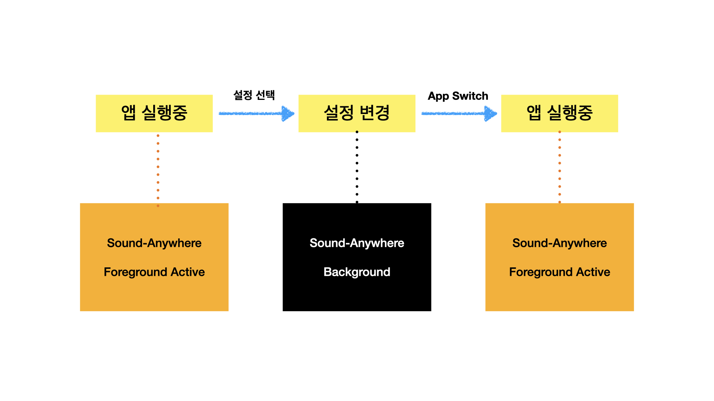

## Problem : CoreLocation 위치권한처리

---

### 1. 인증요청을 언제 보낼 것인가?

- requestWhenInUseAuthorization 채택

```
1) background location service 필요하지 않음.
2) location authorization prompt 띄우기 위한 제약조건 (만족하지 않으면 띄우지 않음)
- App foreground. 
- notDetermined 상태.
```

- 인증상태 변경 시나리오

```
- location authorization prompt 항목 선택.
- 설정 -> 앱 -> 위치권한 변경.
- 설정 -> 개인정보보호 -> 위치서비스 변경.
```

- Solve (App Target iOS 13.0 -> Scene-Based Life-Cycle 고려)

Scenario 1 : 앱 실행 최초 authorizationStatus notDetermined

```
해결: viewDidAppear Event -> requestWhenInUseAuthorization.
notDetermined 이외 status인 경우 시스템이 무시.
```

Scenario 2 : 유저가 설정에서 authorizationStatus 변경

```
해결: SceneDidActivate 이벤트 -> requestWhenInUseAuthorization.
notDetermined 이외 status인 경우 시스템이 무시.
```



- Decision : Scenario 1,2 merged events -> requestWhenInUseAuthorization

```swift
Observable
    .merge(viewDidAppearRelay.asObservable(),
           sceneDidActivateRelay.asObservable()
    )
    .subscribe(onNext: { _ in
        commandCLLocationServiceUseCase.requestWhenInUseAuthorization()
    })
    .disposed(by: disposeBag)
```

---

### 2. 최초 didChangeAuthorization 이벤트 받지 못하는 문제

- RxCoreLocation을 참고하여 구현한 CoreLocationService가 제공하는 observeAuthorizationStatus는
CLLocationManager init 시점 방출되는 최초 Event를 oberve 하지 못함. RxCoreLocation도 갖고 있는 문제.

```
해결 : initialAuthorizationStatus 옵셔널 프로퍼티 정의. didChangeAuthorization delegate method
invoke 시 initialAuthorizationStatus가 nil 이면 초기화.

이득 : 최초 Map 화면 진입시 initialAuthorizationStatus에 따른 초기 화면설정 가능.
```

---
